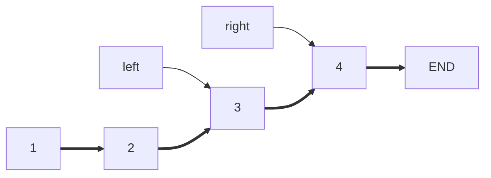
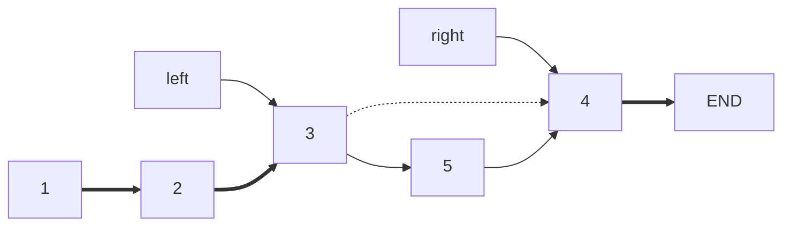
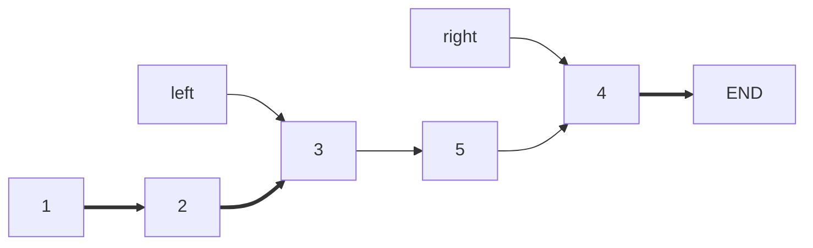
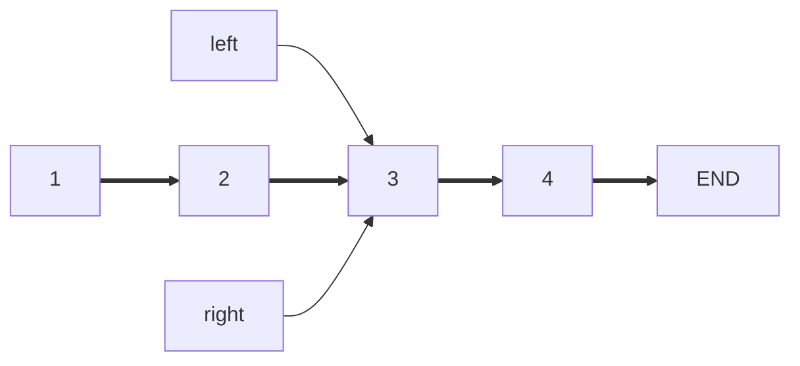
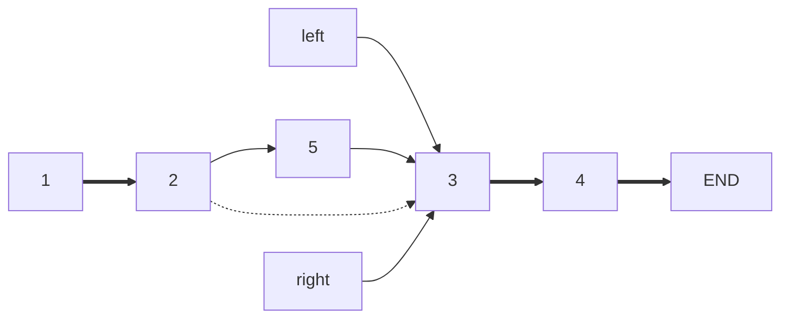
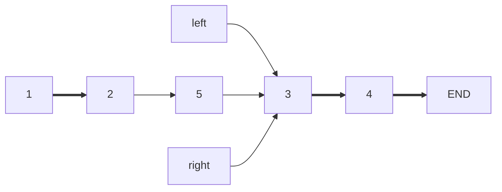
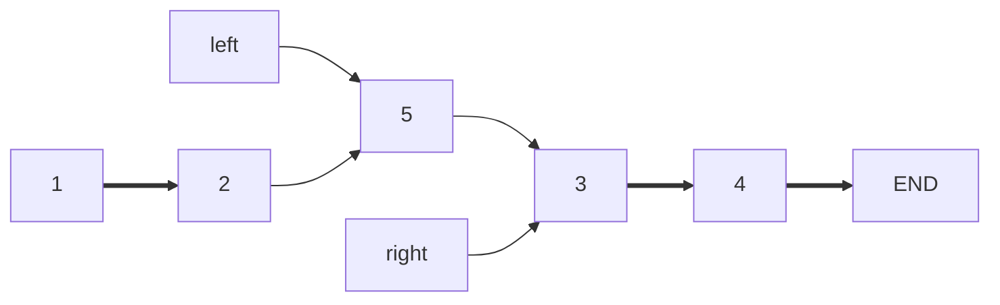

# #37 小明的list 简要题解

## 任务要求

这道题的基本要求就是使用C++的list数据结构实现类似Python的list的结构，首先根据题面，我们得知要我们完成的任务包括：

- `append`函数实现向list尾部添加元素
- `operator[]`函数实现下标访问

- 实现`cout`流输出
- 实现结构切片slice功能

其中根据Python的语言特性提出了以下简单的附加要求：

- 对象都是引用
- 对slice的插入也会导致原列表的更改

这些东西可以在代码后面简单写一个`// TODO`记录下来，解决一个是一个。

## 已有代码分析

小明给的代码之中实际上已经实现了有一点问题的下标访问以及一个要debug的`append`函数，同时也实现了`output`；同时，我们也要注意到，这种将真实容器指针作为类成员的设计架构已经满足了两条附加要求。所以我们要做的，就变为：

- debug小明的`append`函数
- 修改`output`为`operator<<`
- 修改`operator[]`
- 实现结构切片slice功能

第二条任务是相当简单的，简单放代码：

```cpp
friend std::ostream& operator<<(std::ostream& out, const MyList& src) {
		out << "[";
    if (src.left != src.right) {
        std::list<int>::iterator flag = src.left;
        out << *flag;
      	for (++flag; flag != src.right; ++flag) {
            out << "," << *flag;
        }
    }
    out << "]";
    return out;
}
```

至于下标访问的问题，实际上就是函数返回值类型应该是`int&`而不是`int`，毕竟测试代码中有`y[0] += 5`这样改变数据内容的语句。

下面先挑简单的做，先做slice功能。

## 结构切片

这里面结构切片的调用方式是：

```cpp
MyList z = x(1, 3);
```

这是明显的`operator()`的调用方式。而`operator()`返回的是新的`MyList`对象，而类之中只提供了默认构造函数，这显然是不够的，所以我们还需要实现另外的一些构造函数。由于`MyList`类之中的成员是两个迭代器和容器指针，我们可以简单实现这样的一个以迭代器为参数的构造函数：

```cpp
MyList(
  	const std::shared_ptr<std::list<int> >& _pt,
    const std::list<int>::iterator& _left,
    const std::list<int>::iterator& _right
):
    pt(_pt), left(_left), right(_right) {};
```

之后就可以应用这个构造函数了。

切片的方式是就是给定起止区间端点索引，返回新容器。所以我们只需要得到起止处的迭代器就可以利用刚刚写的构造函数了。得到迭代器的方式就是小明写的`forward`函数：

```cpp
MyList operator()(int leftLoc, int rightLoc) {
    return MyList(pt, forward(leftLoc), forward(rightLoc));
}
```

这样的话结构切片就实现完毕了，下面我们看看小明要debug的地方。

## `append`函数的问题

小明写的`append`函数相当简单，也就是：

```cpp
void append(int i){
		pt->insert(right, i);
}
```

既然这个函数没有发挥应有的作用，我们就需要研究一下STL之中链表的`insert`究竟是什么原理。



**注释：**实在不是特别会用md的mermaid画图，所以这里的图不是很好看。这里约定一下`1,2,3,4,...`以及`END`分别表示链表节点和一个结束节点；`left`以及`right`表示的是两个迭代器。

上面的这个链表，如果执行`insert(right, 5)`，也就是在`right`这个地方插入元素`5`，实际上是这样的过程：



整理之后得到：



然而在`left == right`的时候，比如说：



再次执行`insert(right, 5)`，实际上是这样的：



之后得到的应该是：



而不是希望的：



实际上这个时候就直接`--left`调整一下就可以了，那么我们`append`只要加一个简单的特判就可以了：

```cpp
void append(int i){
		pt->insert(right, i);
  	if (left == right) --left;
}
```

这样我们就完成了小明的所有任务，这个时候直接提交就能AC了。

## 一些额外的话

实际上在做这道题的时候经常出现的一个奇怪现象就是`x[0]`得到的结果是`5`或者`-1`，要么干脆就报错；得到什么结果视编译环境决定。

我猜测这种结果是因为list前面会有一片内存存储着list的长度或者是用来占位的`-1`。

（真心觉得STL有的时候UB还是挺让人难受的TωT）